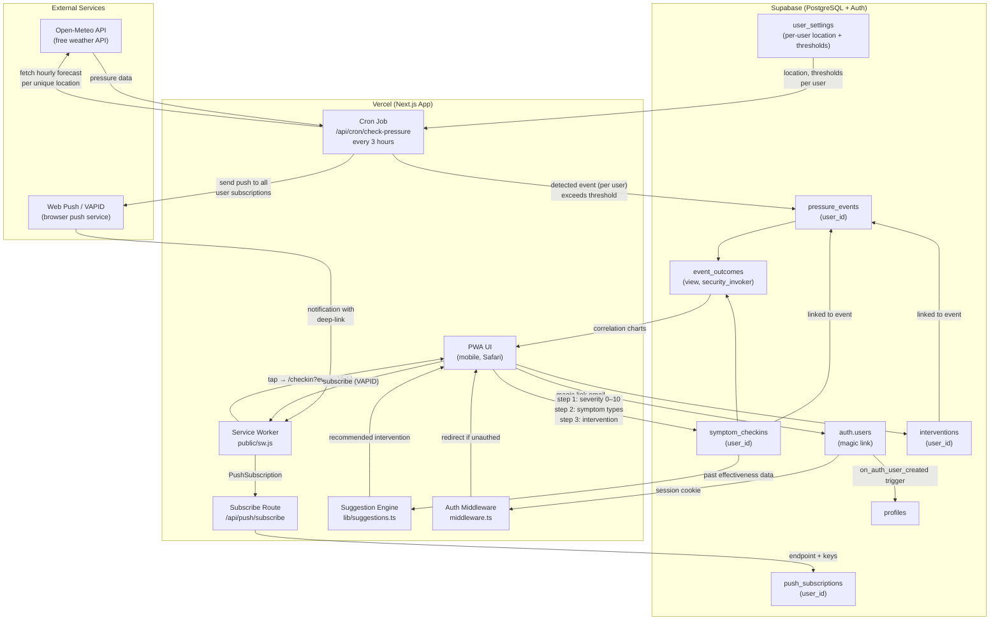

# System Architecture

## Workflow Diagram



## Data Flow Summary

| Trigger | Path | Result |
|---|---|---|
| User visits app (unauthenticated) | `middleware.ts` | Redirect to `/login` |
| User submits email on `/login` | Supabase Auth magic link | Email sent; click → `/auth/callback` → session set |
| New user signs in for first time | `on_auth_user_created` trigger | `profiles` row auto-created |
| Every 3 hours | Vercel cron → reads all `user_settings` → Open-Meteo (deduped by location) | New `pressure_event` per user if threshold exceeded |
| Pressure event detected | Cron → `lib/push.ts` → VAPID push service | Push notification sent to all user's subscriptions |
| User taps notification | Service worker deep-link → `/checkin?event_id=<id>` | PWA check-in flow opens |
| User opens PWA directly | PWA → Supabase (RLS-scoped) | Manual check-in or retroactive entry |
| User enables notifications in Settings | `lib/push-client.ts` → SW registration → `/api/push/subscribe` | `push_subscriptions` row saved |
| User views Analysis tab | PWA → `event_outcomes` view | Correlation charts (Recharts); view returns only user's own rows via RLS |

## Database Schema

```
auth.users             Supabase Auth — one row per user (managed by Supabase)
profiles               Display name; 1:1 with auth.users; auto-created on signup
user_settings          Per-user location, alert thresholds (replaces global key/value settings)
pressure_events        One row per detected or manual pressure event; user_id NOT NULL
symptom_checkins       Severity + symptom types, linked to an event; user_id NOT NULL
interventions          Treatments logged: benadryl, triptan, ubrelvy, hydration, movement, rest, other
push_subscriptions     VAPID push endpoints per user/device (endpoint + p256dh + auth)
event_outcomes         VIEW — aggregates peak/avg severity and intervention timing per event
                         (security_invoker: respects caller's RLS; includes user_id in GROUP BY)
```

## RLS Model

Every table has `user_id uuid NOT NULL references auth.users(id)` and a policy
`USING (auth.uid() = user_id)`. Users never see each other's data.

The **service-role key** (used only by the cron job and push-subscribe route) bypasses RLS,
giving the cron cross-user read access to `user_settings` and `push_subscriptions`.
