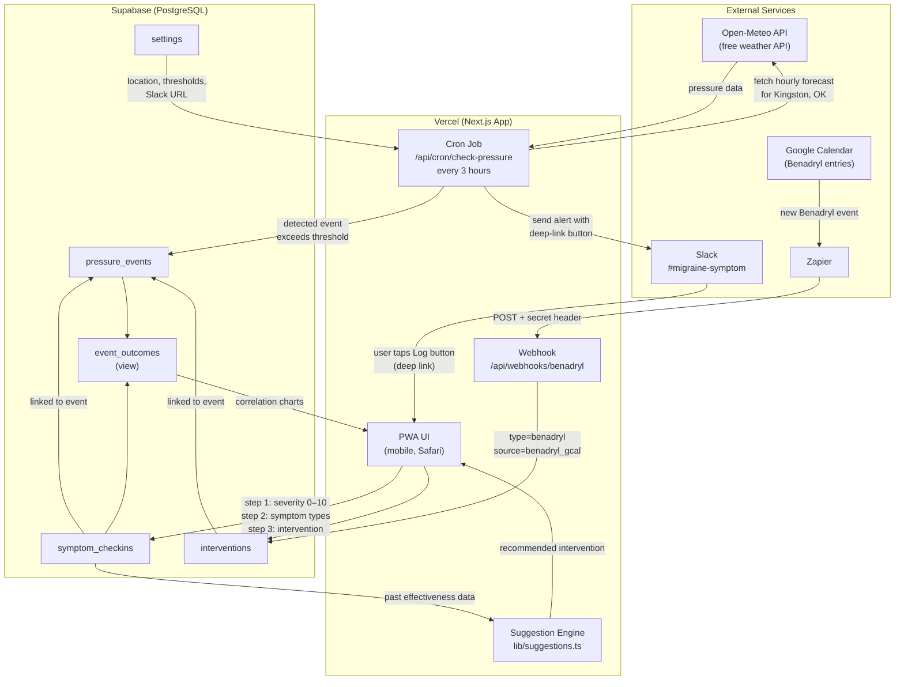

# System Architecture

## Workflow Diagram



## Data Flow Summary

| Trigger | Path | Result |
|---|---|---|
| Every 3 hours | Vercel cron → Open-Meteo → Supabase | New `pressure_event` created if threshold exceeded |
| Pressure event detected | Supabase → Slack notification | Alert sent with deep-link check-in button |
| User taps Slack button | Deep link → PWA check-in flow | `symptom_checkin` + optional `intervention` logged |
| User opens PWA directly | PWA → Supabase | Manual check-in or retroactive event entry |
| Benadryl logged in Google Calendar | Google Calendar → Zapier → webhook | `intervention` row created with `source=benadryl_gcal` |
| User views Analysis tab | PWA → `event_outcomes` view | Correlation charts rendered via Recharts |

## Database Schema

```
settings          key/value config (location, thresholds, Slack URL)
pressure_events   one row per detected or manual pressure event
symptom_checkins  severity + symptom types, linked to an event
interventions     treatments logged, linked to an event (+ optionally a check-in)
event_outcomes    VIEW — aggregates peak/avg severity and intervention timing per event
```
